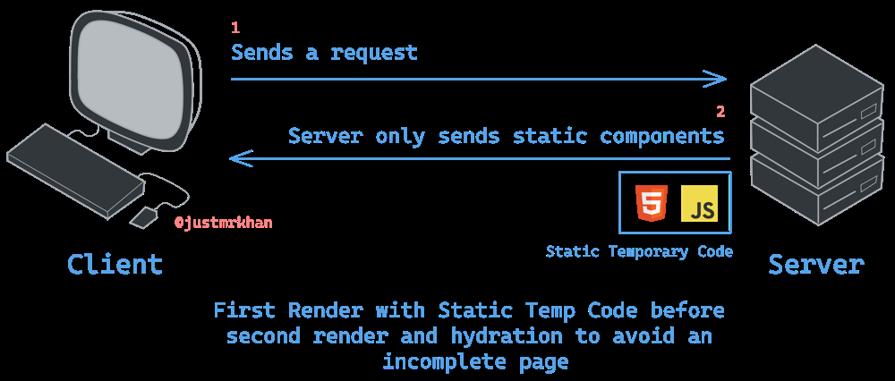

# SSR–CSR Hydration Mismatch: Causes and Solutions (Avoiding FOUT & Upholding OCP)


*Server-Side Rendering (SSR) sends an initial static HTML “skeleton” to the client before client-side JavaScript loads. This lets users see content immediately instead of a blank screen. The client then loads and hydrates the page with real data and interactivity. If the initial HTML doesn’t match the hydrated content (e.g. due to differing theme or state), a hydration mismatch occurs.*  

## 1. Causes of Hydration Mismatch (SSR vs CSR Timing)  
**SSR vs CSR Timing Difference:** Hydration mismatch happens when the HTML produced by SSR differs from what the client-side React expects on first render ([Text content does not match server-rendered HTML | Next.js](https://nextjs.org/docs/messages/react-hydration-error#:~:text=2.%20Using%20checks%20like%20,to%20modify%20the%20html%20response)). This often occurs if SSR had incomplete information (since it runs before browser APIs or user-specific data are available). For example, using browser-only values like `window` or `localStorage` during SSR will produce different output on the server versus client ([Text content does not match server-rendered HTML | Next.js](https://nextjs.org/docs/messages/react-hydration-error#:~:text=2.%20Using%20checks%20like%20,to%20modify%20the%20html%20response)). A common scenario is theme or user preference stored in localStorage: the server can’t see it, so it renders a default state, but the client finds a different value and tries to render something else, leading to a mismatch.

**Example:** Imagine an app that conditionally renders content based on a value in `localStorage`. On the server, `localStorage` is undefined, so SSR might render a “no data” message. Once on the client, `localStorage` reveals data exists, and React tries to show the main content instead – the DOM now differs from what was delivered, causing a hydration error ([How to avoid hydration mismatch when conditionally rendering based on localStorage in Next.js? : r/nextjs](https://www.reddit.com/r/nextjs/comments/1hga9y8/how_to_avoid_hydration_mismatch_when/#:~:text=The%20issue%20arises%20because%20on,instead%2C%20causing%20a%20hydration%20mismatch)). In one case, an SSR page pre-rendered a `<NoProject/>` component because no project ID was available server-side, but on load the client found a project ID in storage and swapped in the main project content, triggering a mismatch ([How to avoid hydration mismatch when conditionally rendering based on localStorage in Next.js? : r/nextjs](https://www.reddit.com/r/nextjs/comments/1hga9y8/how_to_avoid_hydration_mismatch_when/#:~:text=The%20issue%20arises%20because%20on,instead%2C%20causing%20a%20hydration%20mismatch)). In summary, any state that is determined at *client runtime* (time, random values, user settings in storage, etc.) can desynchronize SSR and CSR.

## 2. Avoiding FOUT and Ensuring Consistent Styles  
**FOUC/FOUT Issues:** A Flash of Unstyled Content (FOUC/FOUT) is when users briefly see wrong or unstyled UI before the correct styles apply ([Flash of unstyled content - Wikipedia](https://en.wikipedia.org/wiki/Flash_of_unstyled_content#:~:text=A%20flash%20of%20unstyled%20content,2)). In our context, this often means a flash of the wrong theme: e.g. the page loads in light mode then “jumps” to dark mode. This happens if SSR couldn’t apply the user’s actual theme, so it delivered a default style, and then CSR fixes it after hydration ([Eliminating Theme Flicker and Hydration Issues in Next.js | by Ajay Rajput | Feb, 2025 | Medium](https://medium.com/@ajayrajthakur111/eliminating-theme-flicker-and-hydration-issues-in-next-js-3acbae58faa8#:~:text=,overhead%2C%20especially%20on%20slower%20devices)). The result is both a **hydration error risk** (markup/class mismatch) and a **poor UX flicker**. We need to **eliminate the mismatch without introducing FOUT**.

**Solution: Keep SSR and CSR output in sync.** The content and styling rendered on the server must match what the client will initially render. Several strategies help: 

- **Render only generic content on SSR, then customize on client.** One simple approach is to avoid using any client-dependent data during SSR, and then use a `useEffect` on the client to apply dynamic state. This ensures the SSR HTML is a neutral placeholder that matches the client’s initial render (preventing mismatch) ([Text content does not match server-rendered HTML | Next.js](https://nextjs.org/docs/messages/react-hydration-error#:~:text=Solution%201%3A%20Using%20useEffect%20to,run%20on%20the%20client%20only)) ([Text content does not match server-rendered HTML | Next.js](https://nextjs.org/docs/messages/react-hydration-error#:~:text=useEffect%28%28%29%20%3D,)). For instance, you can render a placeholder or default UI on SSR, then in a `useEffect` set state (or add classes) based on `window` or `localStorage`. The Next.js docs demonstrate this pattern using an `isClient` state: SSR renders a fallback (e.g. a static “Prerendered” text), and after mounting, `useEffect` flips state so the client shows the real content ([Text content does not match server-rendered HTML | Next.js](https://nextjs.org/docs/messages/react-hydration-error#:~:text=export%20default%20function%20App%28%29%20,isClient%2C%20setIsClient%5D%20%3D%20useState%28false)). This avoids SSR/CSR divergence by not even attempting to render the varying part on the server. **However, the downside is potential FOUT** – e.g. the user may see the wrong theme or an empty placeholder momentarily (a flash) until the effect runs ([Eliminating Theme Flicker and Hydration Issues in Next.js | by Ajay Rajput | Feb, 2025 | Medium](https://medium.com/@ajayrajthakur111/eliminating-theme-flicker-and-hydration-issues-in-next-js-3acbae58faa8#:~:text=,overhead%2C%20especially%20on%20slower%20devices)). It also delays showing real content, impacting UX.

- **Use CSS to mitigate FOUT if dynamic content is client-only.** If you choose not to render certain theme-specific elements on SSR, you can reduce the flash by using CSS. One trick is to output both versions of an element in SSR and hide one via CSS, then toggle visibility on the client. For example, to avoid a theme-based image mismatch, SSR could include both a light and dark image with one hidden, and then use a media query or class to show the correct one ([GitHub - pacocoursey/next-themes: Perfect Next.js dark mode in 2 lines of code. Support System preference and any other theme with no flashing](https://github.com/pacocoursey/next-themes#:~:text=match%20at%20L731%20avoid%20the,For%20example)). This way, the DOM structure is consistent (no hydration error) and CSS ensures only the appropriate styled content is visible once styles are loaded. Similarly, if you delay rendering until after mount, you might initially hide content with CSS to avoid showing a wrong placeholder. These workarounds can prevent a jarring flash, but they complicate markup and are not the most elegant solution.

- **Prefer SSR rendering with correct styles from the start.** The ideal is to have SSR output already reflect the user’s actual settings so there is no discrepancy or flicker. For theming, this means the server needs to know the user’s preferred theme (light/dark) *at render time*. If the server can determine that (more on how in the next sections), it can embed the correct theme class or styles into the HTML. For example, setting a `<body class="dark">` or `<html data-theme="dark">` on the server ensures the initial paint is in dark mode for that user ([Eliminating Theme Flicker and Hydration Issues in Next.js | by Ajay Rajput | Feb, 2025 | Medium](https://medium.com/@ajayrajthakur111/eliminating-theme-flicker-and-hydration-issues-in-next-js-3acbae58faa8#:~:text=%2A%20Server,toggles%2C%20keeping%20everything%20in%20sync)). The client then hydrates on top of identical markup, so no hydration error occurs and no theme flash is seen. As Ajay Rajput notes, rendering the proper theme on the server yields a *correct initial render with no wrong-theme flicker, and smoother hydration since server and client markup match* ([Eliminating Theme Flicker and Hydration Issues in Next.js | by Ajay Rajput | Feb, 2025 | Medium](https://medium.com/@ajayrajthakur111/eliminating-theme-flicker-and-hydration-issues-in-next-js-3acbae58faa8#:~:text=,match%2C%20hydration%20is%20much%20smoother)). In practice, one can implement this by reading a theme cookie (or other hint) in SSR and injecting a class or inline style accordingly. Additionally, an **inline script** can be included in the HTML `<head>` to set up any needed client state *before* the browser paints. For instance, a small script can read `localStorage.theme` and apply the appropriate `document.documentElement.className` immediately, ensuring CSS for the chosen theme is applied from the first moment. This script runs before React hydration, so it prevents the default flash altogether. (Many dark mode implementations use this snippet to avoid FOUC.)

In summary, to solve hydration mismatches **and** avoid FOUT, the best approach is to produce identical initial UI on both server and client. If SSR can’t know the real data, you either delay rendering that part until client (with possible UI flash), or find a way to inform SSR of the needed state. The next sections explore how to supply SSR with client state (like theme) without breaking architecture principles.

## 3. Designing for Open-Closed Principle (OCP)  
When implementing the above solutions, it’s important to do so in an architecturally sound way. The *Open-Closed Principle (OCP)* states that software modules should be **open for extension but closed for modification** ([Open-Closed Principle – SOLID Architecture Concept Explained](https://www.freecodecamp.org/news/open-closed-principle-solid-architecture-concept-explained/#:~:text=Explained%20www.freecodecamp.org%20%20The%20open,extension%2C%20but%20closed%20for%20modification)). In this context, our UI architecture should allow adding new themes or state sources without rewriting core logic. How can we uphold OCP while fixing hydration issues?

**Encapsulation and Abstraction:** Rather than scattering ad-hoc checks for `window` or `localStorage` across many components, centralize the client-vs-server distinction. For example, create a **ThemeContext** or a utility module that handles retrieving the user’s theme. This module can have two pathways – one for server (e.g. read from cookies or request headers) and one for client (e.g. read from `localStorage`). Components simply use the theme value from context, unaware of where it came from. This way, if you introduce a new way to determine theme (say, from a URL param or a different storage), you can extend that context logic **without modifying each component**. The core components remain “closed” to modification (they just consume a theme prop), but the system is “open” to new sources of theme via the context/provider layer.

**Example – Theme Provider:** In Next.js App Router, one can implement a ThemeProvider that takes an `initialTheme` prop. On the server, you retrieve the theme preference (from cookie or elsewhere) and pass it to this provider. On the client, the provider might also sync with local storage or allow switching, but initially it uses the server-sent value. This design cleanly separates *how* the theme is obtained from *how* the components use it. For instance, a Next.js 13 `RootLayout` can do: 

```jsx
// Pseudo-code for Next.js 13+ App Router
const cookieStore = cookies();
const theme = cookieStore.get("theme")?.value || "light";  // get theme from cookie, default to light
return <ThemeProvider initialTheme={theme}>{children}</ThemeProvider>;
```  

During SSR, the `theme` cookie is read and passed in, so the ThemeProvider knows to render (for example) the dark theme classes if needed. Later, if we wanted to extend this to also respect OS `prefers-color-scheme` or a user profile setting, we could extend the cookie reading logic or provider internals **without changing the child components**. This approach aligns with OCP by isolating variability behind an interface (the provider). It also prevents code duplication – we don’t query cookies in every component, just once in the provider.

**Maintainability:** Another OCP-friendly pattern is to use **middleware or hooks** in the rendering pipeline to inject state. For example, in an Express SSR app, you might write a middleware that detects user preferences (cookie, etc.) and attaches it to `res.locals` or the React context before rendering. In Next.js, you might use a custom `_document` or the built-in Middleware to add a `<script>` or `data-theme` attribute to the HTML. By handling this in one place (middleware) rather than peppering checks everywhere, the solution is cleaner and open to improvement (you could enhance the middleware to handle more cases later). The key is that new requirements (like supporting a new theme or a new type of user preference) should be implementable by adding new code or configuration, **not by rewriting existing rendering logic**.

## 4. Client State Storage Alternatives (Beyond Cookies & localStorage)  
Cookies and `localStorage` are the most common ways to persist client state (like theme preferences), but the question asks for alternatives. Each method has pros/cons regarding SSR compatibility:

- **Cookies:** Cookies are sent with HTTP requests, so the server automatically has access to them on each SSR request. This makes cookies a straightforward way to share client preferences with the server ([reactjs - Fetching Theme Preference from Local Storage in Next.js Directly - Stack Overflow](https://stackoverflow.com/questions/78317016/fetching-theme-preference-from-local-storage-in-next-js-directly#:~:text=As%20suggested%20by%20%40amirseify%20and,server%20itself%20on%20the%20client)). The downside is they are included in every request (overhead in network traffic), and they have size limits and security considerations. Still, for small data like a theme setting, cookies are generally the easiest reliable method to ensure SSR knows the client’s state.

- **Web Storage (localStorage/sessionStorage):** These are client-only; SSR cannot directly read them. One alternative is for the **client to actively communicate its state to the server** on the first load. For instance, your app’s script could read localStorage and then set a cookie or make a quick API call to inform the server of the preference. But doing this *after* page load defeats the purpose (the first SSR already happened). A better approach is to set up the preference ahead of time, e.g. if the user logs in or explicitly changes a setting, update a cookie at that moment so that subsequent SSR pages know about it. In summary, localStorage alone isn’t accessible to SSR ([reactjs - Fetching Theme Preference from Local Storage in Next.js Directly - Stack Overflow](https://stackoverflow.com/questions/78317016/fetching-theme-preference-from-local-storage-in-next-js-directly#:~:text=As%20suggested%20by%20%40amirseify%20and,server%20itself%20on%20the%20client)), so it needs a proxy (cookie, or an API call that the server can use).

- **URL Parameters / Routing:** In some cases, state can be embedded in the route. For example, you could have routes like `/dashboard?theme=dark`. The server can parse that query param and render accordingly. This is not common for user prefs like theme (since it would bloat URLs and isn’t secure or persistent), but it’s an alternative for certain state (like feature toggles or AB test variants) that you want SSR to handle without cookies. It keeps state open for extension (just add new params) but not ideal for something like theme which should persist across pages.

- **Server-Side Session or Database:** You could store the user’s preference in a server-side session or database. On SSR, the app could query that store (e.g. using a user ID from a cookie or authentication token) to get the needed state. For example, when a user logs in and chooses dark mode, you save that in their profile on the server. Then every SSR request (with the user’s session cookie) can retrieve the profile and see the theme preference. This avoids sending the theme in every request (like cookies do) and can be more secure. However, it requires an extra lookup on each SSR render – essentially an API/database call – which can hurt performance if not optimized (more on this in the next section). It also adds complexity in maintaining server state consistency.

- **Client Hints (HTTP Headers):** Modern browsers support **User Preference Client Hints** such as `Sec-CH-Prefers-Color-Scheme` ([Sec-CH-Prefers-Color-Scheme - HTTP - MDN Web Docs](https://developer.mozilla.org/en-US/docs/Web/HTTP/Headers/Sec-CH-Prefers-Color-Scheme#:~:text=The%20HTTP%20Sec,light%20or%20dark%20color%20themes)). If enabled, the browser will send an HTTP header indicating the user’s OS-level theme preference (“light” or “dark”) on each request. The server can opt-in to receive this by sending `Accept-CH: Sec-CH-Prefers-Color-Scheme` in responses ([Detecting dark mode on every request  - DEV Community](https://dev.to/bryce/detecting-dark-mode-on-every-request-21b2#:~:text=As%20of%20Chromium%2093%2C%20the,your%20server%20allows%20this%20header)). With this, even on the very first visit, the server knows if the user prefers dark mode *without any cookie or script*. It can then SSR the page accordingly (e.g. serve dark CSS or add dark class) ([Detecting dark mode on every request  - DEV Community](https://dev.to/bryce/detecting-dark-mode-on-every-request-21b2#:~:text=You%20can%20then%20get%20the,user%27s%20preference%20from%20the%20request)). The limitation: it only conveys system preference, not a user-selected override stored in localStorage (unless the user’s override also flips their system setting, which is unlikely). Also, not all browsers may support it (as of Chromium 93+ it works ([Detecting dark mode on every request  - DEV Community](https://dev.to/bryce/detecting-dark-mode-on-every-request-21b2#:~:text=As%20of%20Chromium%2093%2C%20the,your%20server%20allows%20this%20header)); Safari/Firefox support may vary). Still, it’s a powerful alternative for initial theming. In practice, you might use client hints to handle first-load theme, and then set a cookie once the user explicitly changes their theme in your app.

- **Other Storage:** There are other client-side storage options (IndexedDB, service worker cache, etc.), but none of these are accessible during SSR. They would require the same pattern of syncing to the server via cookies or API. For example, a service worker could intercept the first request and add a header with the state from IndexedDB – but that’s an edge case and essentially re-invents what cookies already do. So while you can store client state in many places, the server will only know about it if it’s transmitted somehow (cookie, header, or request body).

In summary, aside from cookies and localStorage, the viable alternatives for sharing client state with SSR are **HTTP-based mechanisms** (cookies, headers, or server-side storage tied to the user). For the theme problem, cookies remain the standard solution because they are simple and built-in ([reactjs - Fetching Theme Preference from Local Storage in Next.js Directly - Stack Overflow](https://stackoverflow.com/questions/78317016/fetching-theme-preference-from-local-storage-in-next-js-directly#:~:text=As%20suggested%20by%20%40amirseify%20and,server%20itself%20on%20the%20client)). Client hints are a nice augmentation for system theme, and server-side profiles work for logged-in users. The key is to choose a method that doesn’t break the OCP design – i.e., the rest of the app should just ask “what’s the theme?” from a unified source, without caring if it came from a cookie, header, or database.

## 5. Middleware and Server–Client Coordination  
Using middleware can greatly help in coordinating state between server and client, especially in frameworks like Next.js or Express. **Middleware** here refers to code that runs on the server for each request, before the page is rendered, to inspect or modify the request/response.

**State Injection via Middleware:** In Next.js (12+ with the Pages router or 13 with App router), you can use a middleware file (`middleware.js` or `.ts`) that runs on Edge for every request. This can read cookies or headers from the incoming request and perform actions like rewriting to a different URL, or adding custom headers. For our use case, a middleware could check if a theme cookie exists; if not, it might examine the `Sec-CH-Prefers-Color-Scheme` hint or default to light, then set a cookie or embed that info. Essentially, the middleware can ensure the request arriving at SSR has the necessary data. Next.js documentation notes that *you can see and modify incoming requests with middleware* ([A Complete Guide To Using Cookies in Next.js - PropelAuth](https://www.propelauth.com/post/cookies-in-next-js#:~:text=A%20Complete%20Guide%20To%20Using,and%20modify%20the%20incoming)), making it a good place to enforce consistent SSR behavior. For example, you might write:  

```js
export function middleware(req) {
  const theme = req.cookies.get('theme') || req.headers.get('Sec-CH-Prefers-Color-Scheme');
  if (theme) {
    // Optionally, add a response header or cookie to forward this to the rendering logic
    req.headers.set('x-user-theme', theme);
  }
  // continue to rendering
}
```  

Then in your SSR logic, you read `x-user-theme` from the request and use it to render the page theme. This way, all requests have a uniform handling of theme selection before React even renders a component.

In a custom SSR setup (like using Express + ReactDOMServer), middleware could do something similar: parse cookies and attach data to the request or response locals. By the time the React app is rendered on the server, it can pull from `res.locals.theme` rather than guessing. This separation of concerns keeps the rendering code cleaner (adhering to OCP, since the renderer doesn’t need to know *how* to get theme, it’s provided via context).

**Synchronizing Server and Client:** Middleware can also handle tasks like **setting cookies based on client info**. For instance, the first time a user visits, you might have no theme cookie. If their browser sends `Sec-CH-Prefers-Color-Scheme: dark`, the middleware could set a `theme=dark` cookie on the response. This way, subsequent requests (or even the current SSR if you manage to loop it in) treat the user as dark mode. Another approach is using a small inline script (as mentioned) that writes a cookie. Some apps include a snippet that runs before React hydration which does: `document.cookie = "theme=" + (localStorage.theme || systemPreference)`. That ensures the cookie is there for the next page load or SSR navigation.

Be mindful that using middleware or any per-request logic can affect performance and caching. Personalized responses (varying by cookie) mean you can’t fully cache the HTML across users. If using an external CDN, you’d need to add `Vary: Cookie` or similar to avoid cache poisoning. Next.js Edge Middleware runs on Vercel’s edge with low latency, but it still adds some processing time. Ensure that the middleware itself is efficient (e.g., simple cookie parsing, not heavy computations).

In summary, middleware is a powerful tool to glue server and client state: it can intercept requests, propagate client preferences to the server rendering process, and even modify responses (like injecting headers or cookies). This helps maintain consistency between SSR and CSR and can be done in an extensible way (you can update middleware logic without touching component code, which again aligns with good architectural practices).

## 6. API Calls and Performance Considerations  
One concern is whether the SSR needs to call an API server to get client-specific data (and what impact that has). Ideally, **we want to avoid additional network calls during SSR** if possible, because they can significantly slow down time-to-first-byte. Each API call during SSR is part of the critical path – the user is waiting for the page, which is waiting on that API response.

**Avoiding Unnecessary SSR API Calls:** It’s a best practice to **minimize SSR API fetches** ([Improving Angular 18 SSR Performance | by Oleg Tkachev | Oleg Tkachev Blog | Medium](https://medium.com/alehtkachou/improving-angular-18-ssr-performance-7e4e09b32799#:~:text=,This%20will%20improve)). If the needed state can be derived from the request (cookies, headers, URL) or cached server-side, that’s preferable. For example, retrieving the theme from a cookie is virtually instantaneous and happens in-process, whereas calling an external preference service would add latency. In cases where you must call an API (say SSR needs to load user data from a database), try to **batch or cache**. You might fetch multiple needed pieces of data in one request, or use server-side caching for frequent requests so that repeated SSR renders don’t hit the database every time.

**Impact on Performance:** An extra API call can add hundreds of milliseconds or more, especially if the API is remote. This increases the SSR response time, which in turn delays when the user sees the page. If such calls are needed, consider using techniques like **server-side data caching or state transfer**. Framework-specific solutions exist (Angular has TransferState to send fetched data to the client in the HTML ([Improving Angular 18 SSR Performance | by Oleg Tkachev | Oleg Tkachev Blog | Medium](https://medium.com/alehtkachou/improving-angular-18-ssr-performance-7e4e09b32799#:~:text=,This%20will%20improve)); in React/Next, you can serialize fetched data into the HTML as a JSON script and hydrate it on the client to avoid re-fetching). The goal is to not do the same work twice. For example, if SSR calls `/api/getUserPrefs` to get theme = dark, you’d want to embed that in the page so the client doesn’t call `/api/getUserPrefs` again on load. This can be as simple as a `<script>window.__USER_PREFS__ = {...}</script>` in your HTML.

**When API Calls are Necessary:** There are cases where you might accept the performance hit for the benefit of SSR content. For instance, an e-commerce site might SSR render a personalized homepage with user’s name and recommendations. Getting that data might require API calls. The benefit is the user sees a tailored page on first paint (better UX, possibly higher engagement), but the cost is a slower initial load. You should analyze whether the improved UX is worth the added time. Often, critical user-specific data can be kept in a fast-access store (like an in-memory cache keyed by user ID) to mitigate delay.

**Performance vs. Personalization Trade-off:** If performance is paramount (e.g. landing pages for SEO), you might decide *not* to SSR certain user-specific pieces at all. For example, you could SSR a generic page and have the client script load the personalized bits after hydration. This would maximize SSR caching and speed (since the SSR output is same for everyone), at the cost of a slight delay in showing personalized content. Conversely, if a bit of state (like theme) is lightweight, you should SSR it to avoid a flash/flicker. The theme is actually a great example of something that is cheap to include in SSR (just a class name) and hugely beneficial to UX when done so.

In short, **reduce SSR API calls whenever possible** ([Improving Angular 18 SSR Performance | by Oleg Tkachev | Oleg Tkachev Blog | Medium](https://medium.com/alehtkachou/improving-angular-18-ssr-performance-7e4e09b32799#:~:text=,This%20will%20improve)). Use cookies or hints for simple data (no extra call). If you need to call APIs, do it smartly: parallelize them if multiple, cache results, and transfer the data to the client to avoid duplicate fetching. Always measure the impact – sometimes a small 50ms delay for an API is acceptable, but a 500ms one is not. If an API call is too slow and cannot be optimized, reconsider if that data is truly needed at SSR or if it can wait until after first paint.

## 7. Optimizing Initial Load Time and UX  
Finally, we consider the **overall initial loading experience**. The best UX is achieved when users perceive the app to load fast and not jarringly change after load. Some best practices to minimize initial load time and ensure a smooth experience include:

- **Critical Rendering Path Optimization:** Send as little HTML/CSS/JS as needed for the initial view. Minify and compress assets. If using SSR, try to inline critical CSS so that the first paint has styling without an extra round-trip, but don’t inline so much that it bloats the HTML. Avoid heavy JavaScript execution before paint. In context of our theme example, the inline theme-switching script should be just a few lines – negligible impact – and it should run immediately to avoid delay in applying styles.

- **Lazy Load Non-Essential Content:** If certain parts of the page are below the fold or not immediately needed, you can load them after the initial content. Frameworks allow code-splitting and dynamic imports (e.g. Next’s `dynamic()` with `{ ssr: false }` can defer loading a component entirely until client side). This reduces the SSR payload and JS bundle size, speeding up initial render. Just be careful to use this for truly non-critical UI, and consider adding skeletons or spinners so the user isn’t confused by missing sections. For instance, a heavy analytics widget could be loaded after hydration rather than during SSR.

- **Use of Streaming and Partial Hydration:** React 18+ supports streaming SSR, which can send chunks of HTML to the browser as they are ready, rather than one big block at the end. This can improve TTFB (Time to First Byte) and make content appear sooner. Additionally, techniques like React Server Components (in Next.js app router) can further split what logic runs on server vs client. The idea is to minimize what needs hydration at all. If most of your page is simple text or static content, those parts can hydrate quickly or even be fully static, and only interactive components hydrate. This reduces the scope of hydration mismatch issues as well, since fewer components rely on client state.

- **Pre-fetching & Caching:** Anticipate what data will be needed and fetch it ahead of time if possible. For example, if a user is logged in and you know you’ll need their preferences on every page, set a cookie or embed a `<script>` with that data on the first page so subsequent navigations have it. Also, use HTTP caching (with appropriate cache keys for user-specific content) to speed up repeated visits. A logged-in user’s theme might not change often, so you could mark responses as cacheable per user for some short period, allowing intermediate proxies to serve subsequent requests faster (be cautious with personal data in caches though).

- **Visual Feedback:** Even with optimizations, some amount of loading time is inevitable. To keep UX optimal, provide feedback. This could be subtle: ensure the layout is stable (avoid massive layout shifts during hydration), use placeholders that resemble the final content (to avoid sudden changes), or show a loading spinner if something is truly waiting on data. For theme specifically, one trick to avoid a white flash is setting a background color in the HTML or body that matches the expected theme. For example, if you know the user prefers dark, you could set `<body style="background-color: #000;">` in SSR. This way even if CSS hasn’t loaded, the blank page is dark rather than blinding white.

- **Testing on Slow Devices/Networks:** To achieve optimal UX, test how your SSR/CSR handoff performs in real-world conditions – e.g., a 3G network or a low-end device. A solution that looks fine on a fast PC (a 100ms flash) might be very noticeable on a slower phone (500ms or more). You may need to further optimize or refine the approach (perhaps loading a minimal inline CSS for critical above-the-fold content). The Medium article by Ajay Rajput quantified that fully handling theme on the server improved Time to Interactive by ~11% vs a client-only approach ([Eliminating Theme Flicker and Hydration Issues in Next.js | by Ajay Rajput | Feb, 2025 | Medium](https://medium.com/@ajayrajthakur111/eliminating-theme-flicker-and-hydration-issues-in-next-js-3acbae58faa8#:~:text=,%E2%80%94%20this%20is%20the%20smoothest)). This kind of data-driven insight underscores that eliminating hydration mismatch and FOUT isn’t just cleaner, it’s tangibly faster.

In summary, **fast initial load** comes from sending the user exactly what they need for the first paint – no less (to avoid blank or unstyled content) and no more (to avoid slow delivery). Our hydration mismatch fixes should align with that goal: by SSR rendering the correct content (e.g. correct theme, user-specific HTML), we show meaningful UI immediately. By not having to do massive DOM repairs on the client (no hydration errors to fix), we also reduce wasted work. The result is a quicker, smoother loading experience.

## 8. Patterns and Best Practices (SSR + Client Components)  
Combining all the above, we can propose an optimal pattern to handle user-specific state in SSR while avoiding mismatches and maintaining clean architecture:

- **Single Source of Truth for State:** Establish a context or state provider that can consume initial values from the server. For instance, a theme context reads an `initialTheme` prop (populated via SSR) but also allows client updates. This ensures SSR and CSR use the same value initially, preventing mismatch. The component tree doesn’t directly call `localStorage` or `document.cookie` – it just uses context, which is fed by the appropriate source. This pattern can be extended (OCP) to other state like locale, feature flags, etc., each with their own provider.

- **Server Preparation of Data:** On each request, use either built-in framework APIs (Next.js `cookies()` in server components, or getServerSideProps in older Next, or Remix loaders, etc.) or custom middleware to gather all necessary client-specific data **before** rendering. This may involve reading cookies, decoding JWTs, or minimal API calls (e.g. get user settings). Put these into a structured object (e.g. an initial redux store state, or multiple context props). Then render the React app with those values. This way, the HTML sent to the client already reflects the user’s state (theme, etc.). If using Next.js App Router, for example, your RootLayout can fetch cookies and pass them to context as shown above ([reactjs - Fetching Theme Preference from Local Storage in Next.js Directly - Stack Overflow](https://stackoverflow.com/questions/78317016/fetching-theme-preference-from-local-storage-in-next-js-directly#:~:text=1,RootLayout)) ([reactjs - Fetching Theme Preference from Local Storage in Next.js Directly - Stack Overflow](https://stackoverflow.com/questions/78317016/fetching-theme-preference-from-local-storage-in-next-js-directly#:~:text=return%20%28%20,%29)). In classic SSR, you might do something like: `const appHtml = ReactDOMServer.renderToString(<App theme={themeFromCookie} data={apiData}/>)` – injecting the data.

- **Inline Script for Early Bootstrapping:** Insert any needed tiny script in the `<head>` of the HTML to bridge the gap between SSR and hydration. A common snippet is one that writes the correct theme class to `<html>` before the CSS loads. For example:  
  ```html
  <script>
    // Avoid flicker: apply saved theme (if any) before styles render
    try {
      var theme = localStorage.getItem('theme');
      if (!theme) {
        theme = window.matchMedia('(prefers-color-scheme: dark)').matches ? 'dark' : 'light';
      }
      if (theme) document.documentElement.classList.add(theme);
    } catch(e) { /* ignore */ }
  </script>
  ```  
  This runs immediately, using either the saved theme or system preference as a fallback. If your SSR already set the class, this script ensures it stays consistent (or syncs localStorage for future). If SSR couldn’t know the theme (first visit without cookies), this at least applies the correct class at the earliest possible moment on the client to minimize FOUC. *(Note: For security, if you include user data in scripts, ensure it’s safe from injection attacks. In this theme case, it’s fine.)*

- **Graceful Hydration and Updates:** With the above in place, when React hydrates, it finds that the DOM already has (for example) `<html class="dark">` as expected, and your ThemeProvider context is already set to “dark” from SSR. No mismatch occurs because the output is the same. There’s no flicker, because the correct CSS was applied from the start. After hydration, if the user toggles to light mode, your context updates, and you can update both the DOM class and maybe set a cookie (via an API call or using `document.cookie` in an effect) to persist it. The user’s preference is now saved for the next SSR round – completing the loop.

- **No-SSR Components for Truly Client-Only Parts:** Identify any component that *cannot* meaningfully be rendered on the server (perhaps a component that depends on browser APIs heavily, or uses `navigator.geolocation`, etc.). Mark those to skip SSR to avoid accidental mismatch. In Next.js, you’d use `dynamic(..., { ssr: false })` for those, which ensures the server outputs a placeholder (empty div) that the client will fill. Because the SSR and CSR are both effectively an empty placeholder initially, there’s no mismatch. Use this sparingly – it’s essentially opting out of SSR for that piece, so you lose the SEO/performance benefit for it – but it’s better than crashing hydration. Often, you can redesign such components to not require this, but it’s an option.

- **Testing and Monitoring:** After implementing these patterns, test under various scenarios: first visit (no cookie), returning visit (cookie present), user toggling preference, etc. Ensure no React hydration warnings appear in the console. Also test that the page doesn’t flash incorrectly. Monitor performance – use browser dev tools to see if any content is blocking rendering or if the Time to First Paint is low. If anything regresses (for example, if adding a cookie read turned a previously static page into a server-rendered one, thus disabling some Next.js optimizations), you might need to adjust. (In Next 13, reading cookies in a server component will indeed make it run on server each time rather than be static cached – which is expected if personalization is needed.)

**Conclusion:** By understanding the timing differences between SSR and CSR and systematically addressing them, we can resolve hydration mismatches while *also* avoiding FOUT. The combination of server-informed rendering and careful client-side adjustments yields the best UX – no console errors, no layout shifts or flashes, and a robust architecture that adheres to SOLID principles (like OCP). 

In practical terms, the **optimal solution** is: *Use SSR to output a page that is already tailored to the user’s state (theme, etc.) by leveraging cookies or similar to get that state on the server.* Ensure the markup and styling are consistent with what the client will do. If SSR knowledge is incomplete, use quick client-side fixes (inline scripts or slight delays) to correct it before the user notices. Structure your code so that this logic is centralized and extensible (e.g. a theme provider, middleware, etc., rather than scattered conditionals). Following these methods, you can eliminate hydration errors ([Eliminating Theme Flicker and Hydration Issues in Next.js | by Ajay Rajput | Feb, 2025 | Medium](https://medium.com/@ajayrajthakur111/eliminating-theme-flicker-and-hydration-issues-in-next-js-3acbae58faa8#:~:text=Benefits)), prevent flashes, and deliver a fast, seamless experience to the user from the first render onward. 

**Sources:** The approach is informed by best practices and examples in the community. For instance, developers have noted that a naive `useEffect` theme switch causes hydration errors and theme flicker ([Eliminating Theme Flicker and Hydration Issues in Next.js | by Ajay Rajput | Feb, 2025 | Medium](https://medium.com/@ajayrajthakur111/eliminating-theme-flicker-and-hydration-issues-in-next-js-3acbae58faa8#:~:text=,overhead%2C%20especially%20on%20slower%20devices)), whereas reading the theme from cookies in SSR can fix mismatches and improve performance ([Eliminating Theme Flicker and Hydration Issues in Next.js | by Ajay Rajput | Feb, 2025 | Medium](https://medium.com/@ajayrajthakur111/eliminating-theme-flicker-and-hydration-issues-in-next-js-3acbae58faa8#:~:text=,match%2C%20hydration%20is%20much%20smoother)). Next.js documentation explicitly warns against using `localStorage` in SSR and recommends strategies like `useEffect` or disabling SSR for those parts ([Text content does not match server-rendered HTML | Next.js](https://nextjs.org/docs/messages/react-hydration-error#:~:text=2.%20Using%20checks%20like%20,to%20modify%20the%20html%20response)) ([Text content does not match server-rendered HTML | Next.js](https://nextjs.org/docs/messages/react-hydration-error#:~:text=Solution%202%3A%20Disabling%20SSR%20on,specific%20components)). Solutions like the `next-themes` library implement many of these ideas (it uses an `attribute` on HTML plus `suppressHydrationWarning` to handle theme changes without errors) ([GitHub - pacocoursey/next-themes: Perfect Next.js dark mode in 2 lines of code. Support System preference and any other theme with no flashing](https://github.com/pacocoursey/next-themes#:~:text=,hydration%20warnings%20on%20other%20elements)) ([GitHub - pacocoursey/next-themes: Perfect Next.js dark mode in 2 lines of code. Support System preference and any other theme with no flashing](https://github.com/pacocoursey/next-themes#:~:text=Avoid%20Hydration%20Mismatch)). Modern articles also show that fully syncing theme on the server side yields the best results (no flicker, minimal overhead) ([Eliminating Theme Flicker and Hydration Issues in Next.js | by Ajay Rajput | Feb, 2025 | Medium](https://medium.com/@ajayrajthakur111/eliminating-theme-flicker-and-hydration-issues-in-next-js-3acbae58faa8#:~:text=Benefits)). And fundamentally, the open-closed principle advice comes from software design guidelines ([Open-Closed Principle – SOLID Architecture Concept Explained](https://www.freecodecamp.org/news/open-closed-principle-solid-architecture-concept-explained/#:~:text=Explained%20www.freecodecamp.org%20%20The%20open,extension%2C%20but%20closed%20for%20modification)) but is very applicable here to keep our theming solution maintainable. By combining these insights, we ensure our SSR/CSR architecture remains robust, extensible, and user-friendly.

